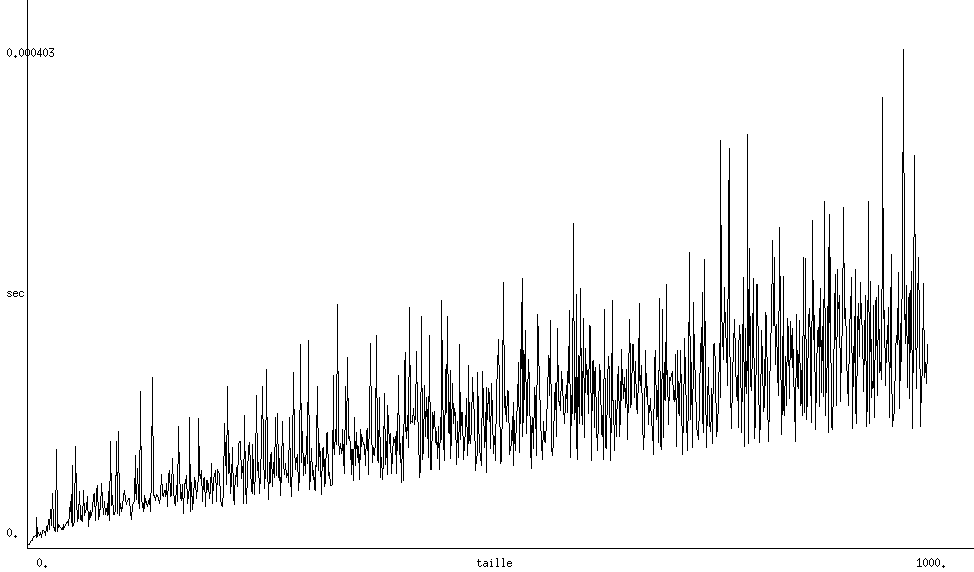
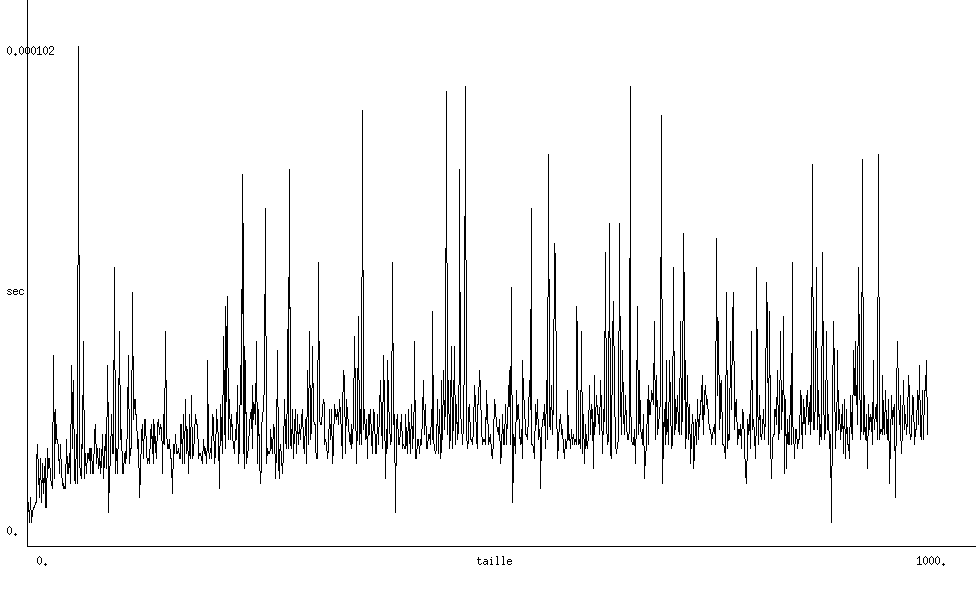
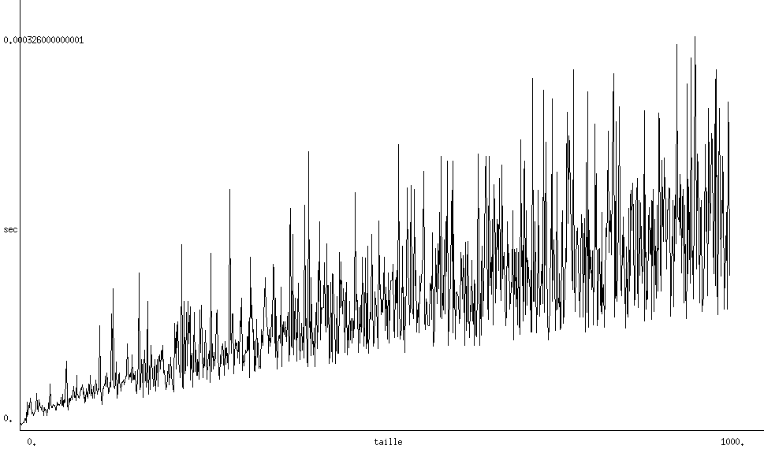

# Algorithme et Programmation 3   Compte rendu de projet

M.Laurent Fuchs 
Groupe 1: Yann Berthelot, Louis Leenart & Alexis Louail
## Partie 1 : Arbres binaires de recherche
### Question 1
// TODO
### Question 2
// TODO
### Question 3
// TODO
### Question 4
&nbsp; Dans notre projet, les ABR sont créés à partir d’une liste générée de manière différente selon si l’on veut un arbre construit à partir de valeurs au hasard où si nous voulons un arbre contenant des sous-suites ordonnées mais en ne prenant toujours qu’un argument ; la taille de la liste voulue. Cela facilite grandement la fiabilité des expérimentations en permettant de pratiquer sur des échantillons semblables.

&nbsp; Afin d’estimer une moyenne des déséquilibres entre les arbres nous avons construit et utilisé plusieurs fonctions : une fonction `unbalance(tree)` qui calcule le déséquilibre d’un arbre, une fonction `unbalance_avg(tSample, treesSize)` qui calcule la moyenne des déséquilibre d’un échantillon d’arbres générés par la fonction (`tSample` étant la taille de l’échantillon et `treesSize` la taille des arbres à créer et évaluer) et enfin une fonction `unbalance_avgs_avg(avgSample, treeSample, treesSize)` qui calcule une moyenne des moyennes des déséquilibres (`avgSample` étant le nombre de moyennes à évaluer).

&nbsp; Cette organisation permet de lancer peu de fois la dernière fonction tout en évaluant un grand nombre d’arbres, nous avons décidé de lancer l’expérimentation 10 fois sur 1000 moyennes de déséquilibre entre 100 arbres de taille 100 afin d’avoir une expérimentation produisant des résultats fiables sur des échantillons similaires (changer les paramètres pourrait fausser les résultats).

|	Expérimentation	|	Résultat pour les arbres au hasard	|	Résultat pour les arbres aves sous-suites	|
| :-------------------------:	|:------------------------------------------:	| :------------------------------------------------:	|
|		1		|		    -0.01604			|			24.45545			|
|		2		|		    -0.00133			|			24.41074			|
|		3		|		     0.00472			|			24.51547			|
|		4		|		    -0.00033			|			24.45549			|
|		5		|		     0.01846			|			24.45782			|
|		6		|		     0.00623			|			24.44097			|
|		7		|		     0.01629			|			24.50553			|
|		8		|		    -0.00629			|			24.47762			|
|		9		|		     0.04008			|			24.55913			|
|	       10		|		     0.02023			|			24.51649			|
|	     Moyenne		|		     0.00820			|			24.47947			|

La complexité des fonctions générant les résultats ci-dessus est en O(n)

On peut clairement conclure que les abr sont bien plus équilibrés lorsqu'ils sont construits à partir de valeurs au hasard.

## Arbres AVL
### Implantation d'un module `Avl`
#### Question 1
&nbsp; Notre implantation du type `Avl` reprend la structure `t_btree` via la déclaration `type 'a t_avltree = 'a bst`. Nous avons aussi implémenté les opérations suivante dans le fichier `avl.ml` : 
- `rd(avl : 'a t_avltree) : 'a t_avltree` effectue la Rotation Droite de l'AVL. Pour ne pas rencontrer d'erreur, il faut que `avl` et `avl.lson` existent.
- `rg(avl : 'a t_avltree) : 'a t_avltree` effectue la Rotation Gauche de l'AVL. Pour ne pas rencontrer d'erreur, il faut que `avl` et `avl.rson` existent.
- `rgd(avl : 'a t_avltree) : 'a t_avltree` effectue la Rotation Gauche Droite de l'AVL, qui repose sur `rd(avl)` et `rg(avl)`.
- `rdg(avl : 'a t_avltree) : 'a t_avltree` effectue la Rotation Droite Gauche de l'AVL, qui repose sur `rd(avl)` et `rg(avl)`.

Des exemples d'utilisation sont fournis dans le fichier `avl_utilisation.ml`.
#### Question 2
&nbsp; Notre implantation de l'opération de rééquilibrage à partir des axiomes. La fonction `reequilibrer(avl : 'a t_avltree) : 'a t_avltree` correspond à cette opération. De plus, nous pouvons aussi utiliser la structure `improvedAvl` qui est sous la forme `('a * int) t_avltree` où `'a` représente la valeur du noeud, et `int` la valeur du déséquilibre. On utilise `getValue(avl : ('a * int) t_avltree) : 'a` et `getDes(avl : ('a * int) t_avltree) : int` pour accéder à la valeur et au déséquilibre de l'arbre.

Des exemples d'utilisation sont fournis dans le fichier `avl_utilisation.ml`.
#### Question 3
&nbsp; Les opérations ajoutées sont : 
- `suppr_avl(a, avl : 'a* 'a t_avltree) : 'a t_avltree` avec `a` la valeur a supprimer, et `avl` l'arbre d'entrée.
- `insert_avl(a, avl : 'a * 'a t_avltree) : 'a t_avltree` avec `a` la valeur a ajouter, et `avl` l'arbre d'entrée. On note que si la valeur `a` existe déjà dans l'arbre, alors on ignore la commande.
- `max(avl : 'a t_avltree) : 'a` retourne l'élément maximal de `avl`.
- `dmax(avl : 'a t_avltree) : 'a t_avltree` retourne `avl` privé de son élément maximal.

Des exemples d'utilisation sont fournis dans le fichier `avl_utilisation.ml`.
#### Question 4
&nbsp; Nous remarquons que l'utilisation de la fonction `bst_seek (elem, tree : 'a * 'a t_avltree) : bool` est encore fonctionnelle pour notre implantation du type `t_avltree`. Cependant, cette fonction devrait être legerement modifiée pour recevoir la structure `'a * int t_avltree`, et cela sans affecter la complexité.
### Expérimentations avec les arbres AVL
#### Question 1
Pour créer des AVL aléatoirement, nous avons mis en place plusieurs fonctions : 
- `rnd_list_int(n, max_val : int * int) : int list` qui permet de créer une liste d'entier de taille `n` compris entre 0 et `max_val`.
- `rnd_sublist(n, max_val, last_val : int * int * int) : int list` permet de créer une liste d'entier de taille `n` compris entre 0 et `max_val` avec `l[n] < l[n+1]`.
- `rnd_list_sub(n, max_val, percent : int * int * int ) : int list` permet de créer une liste d'entier de taille `n` compris entre 0 et `max_val` avec des sous-listes d'entiers de taille de taille 2 à 10. La probabilité de générer une sous-liste ordonnée est définie par l'argument `percent` ( 0 = aucune sous-liste, 100 = que des sous-listes).
- `avl_rnd_create (l : int list) : int t_avltree` permet de créer un AVL à partir d'une liste. Utilise la fonction privée `__avl_rnd_create_aux (l, t : 'a list * 'a t_avltree) : 'a t_avltree`.
- `__avl_rnd_create_aux (l, t : 'a list * 'a t_avltree) : 'a t_avltree` permet de créer un AVL à partir d'une liste.

Nous étudions ensuite la complexité des fonctions `insert_avl`, `suppr_avl` et `bst_seek`. Pour cela, nous calculons le temps d'execution de chacune des fonction, et ce pour des arbres aléatoires de taille 1 à n. Une fois les calculs terminés, nous utilisons le module graphique d'Ocaml pour afficher l'évolution du temps de calcul en fonction de la taille de l'arbre étudié. L'ensemble des fonctions utilisés sont regroupés dans le fichier `avl_plot.ml`. Nous testons alors les différentes fonctions avec une taille d'arbre allant de 1 à 1000.

Fonction de suppression</img> 
Fonction de insertion</img> 
Fonction de recherche</img> 

Nous remarquons que la complexité de ces trois fonctions semble être de l'ordre de O(n). En effet, sans implémenter la structure `'a * int t_btree` pour ces fonctions, il est nécessaire de faire un appel aux fonctions `desequilibre` et `reequilibrer` étant donné que la donné n'est ni conservée ni mise à jour. 

#### Question 2

### a Verif
En créant plusieurs Avl avec des parametres différents pour variés les longeurs des listes et sous-listes d'entiers on peut alors estimer le nomnre moyen de roation qui correspond donc au nombre de sous liste + le nombre d'entiers.
