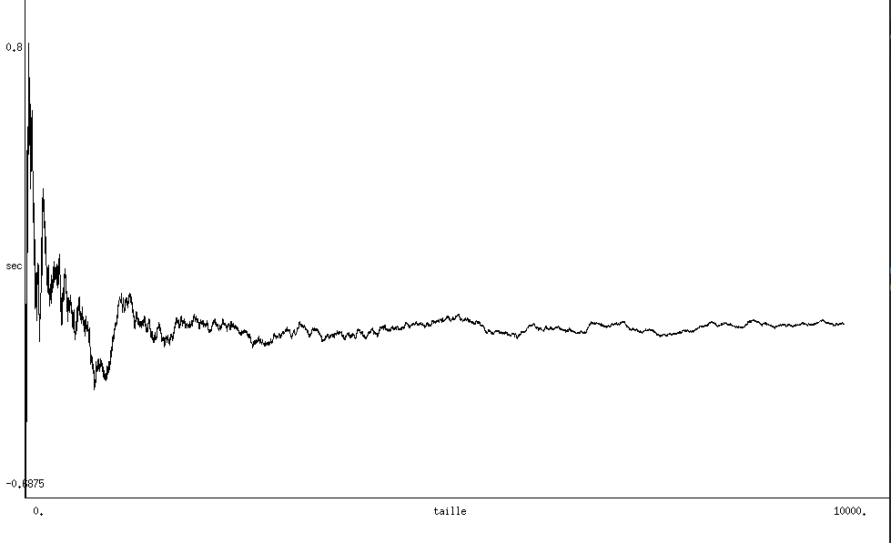
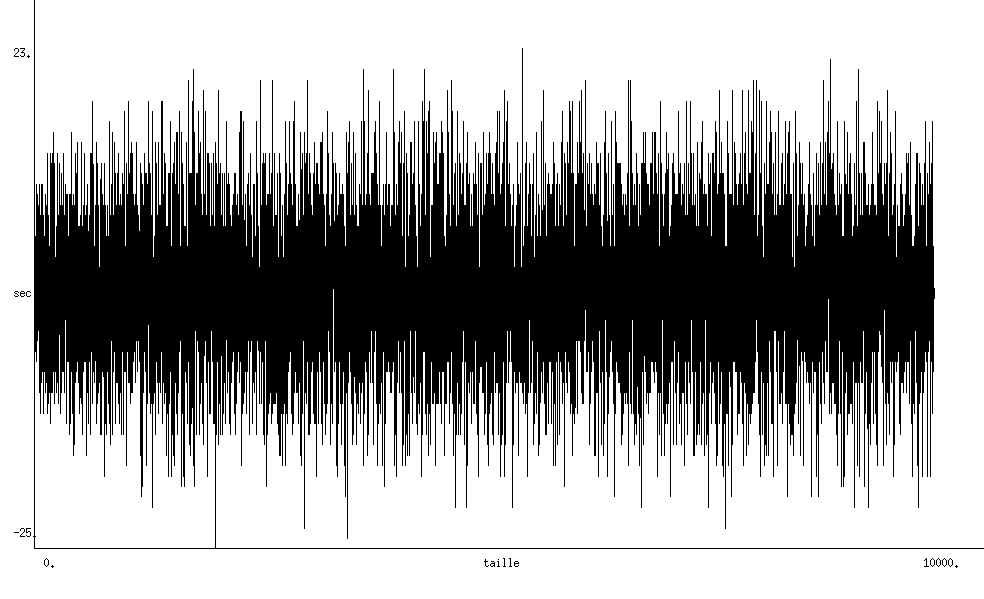
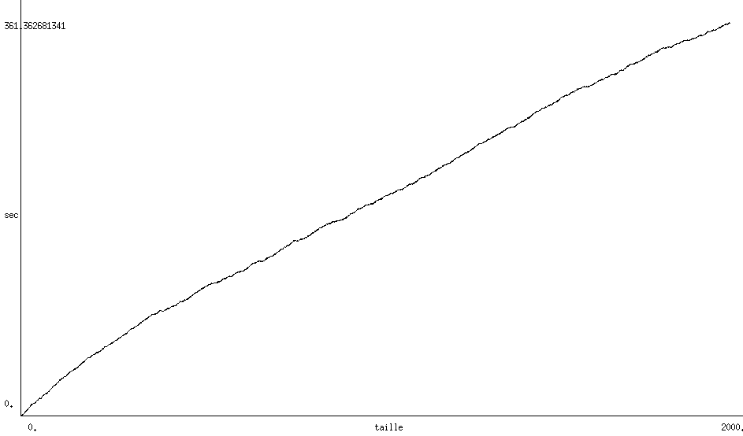
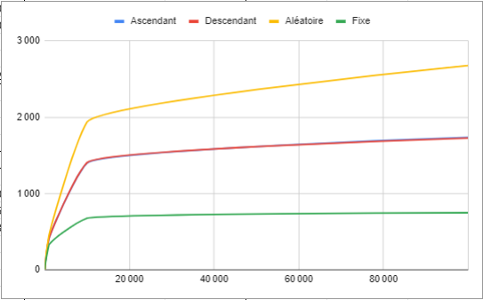

# Algorithmique et Programmation 3 </br> Compte rendu de projet

Enseignant : M.Laurent Fuchs.

Ce projet est à réaliser avant le 5 février 2021 à déposer sur UPDago dans le cadre de l'Unité d'Enseignement "Algorithmique et Programmation 3". Ce projet porte sur les Arbres binaires de recherche (ABR) et les Arbres AVL. Nous étudierons plus particulièrement le déséquilibre de ces arbres et la complexité en temps de certaines opérations de manipulation de ces derniers.

Groupe 1: Yann Berthelot, Louis Leenart & Alexis Louail.


# Introduction 
## Structure des fichiers
Notre structude des fichiers se présente de la facon suivante :
```bash
.
├── README.md                       # Fichier de rédaction du compte rendu
├── data                            # Dossier de données
│   ├── avg_mixed.png               # Graphique de la fct mixed_unbalance_avg
│   ├── avg_rnd.png                 # Graphique de la fct rnd_unbalance_avg
│   ├── bst_mix_create.png          # Graphique de la fct bst_mix_create
│   ├── sujet.pdf                   # Sujet du projet
│   ├── insert.png                  # Graphique du temps d'exec. de la fct insert_avl()
│   ├── seek.png                    # Graphique du temps d'exec. de la fct seek_avl()
│   ├── suppr.png                   # Graphique du temps d'exec. de la fct suppr_avl()
│   └── rotations.png               # Graphique du nbr moyen de rotations des AVL
│
└── src                             # Dossier de code
    │
    ├── main                        # Dossier de code du projet
    │   ├── abr.ml                  # Implantation du module ABR
    │   ├── abr_plot.ml             # Tests de complexité / Affichage d'ABR
    │   ├── avl.ml                  # Implantation du module AVL
    │   ├── avl_plot.ml             # Tests de complexité / Affichage d'AVL
    │   └── avl_utilisation.ml      # Tests de l'implantation d'AVL
    │
    └── usage                       # Dossier de dépendances
        ├── ap2util.ml              # Utilitaire listes
        ├── bst.cmi                 # Arbres binaires de recherche
        ├── bst.cmo                 # Arbres binaires de recherche
        ├── btree.cmi               # Arbres binaires
        ├── btree.cmo               # Arbres binaires
        └── graphics.ml             # Fenetre graphique
```
Le dossier `data` contient le sujet et les graphique d'évolution du temps d'execution de différentes fonctions. Le dossier `src` comprend tous les fichiers OCaml, plus particulièrement, `main` correspond aux fichiers que nous avons fait pour ce projet, et `usage` aux fichiers que nous avons utilisé mais dont nous ne sommes pas les créateurs.

# Partie 1 : Arbres binaires de recherche (ABR)
L'ensemble des fichiers liés au module `ABR` sont les suivants : 
```bash
src
├── main
:   ├── abr.ml                      # Implantation du module
    ├── abr_plot.ml                 # Tests de complexité / Affichage
    :
```
## Question 1
&nbsp; La fonction `bst_rnd_create : int size -> 'a bst` créé un arbre de taille `size`, elle utilise deux fonctions auxiliaires : 
* `gen_rnd_list : int size -> 'a list` qui génère une une liste de la taille de l'int donné en paramètre
* `bst_build : 'a list ls -> 'a bst` qui créé un arbe binaire de recherche à partir de la liste donnée en paramètre
## Question 2
&nbsp; La fonction évaluant le déséquilibre d'un arbre est `unbalance : 'a bst tree -> int`. Elle calcule la différence de hauteur entre le fils gauche et le fils droit d'un arbre.
La fonction `rnd_unbalance_avg : int tSample, int treesSize -> float` calcule la moyenne des déséquilibre d'un nombre tSample d'arbres construits à partir de suites de nombres entiers aléatoires de taille treesSize _Les résultats d'expérimentations se trouvent dans la section consacrée à la question 4._
## Question 3
&nbsp; La fonction `mixed_unbalance_avg : int tSample, int treesSize -> float` calcule la moyenne des déséquilibre d'un nombre tSample d'arbres construits à partir de suites de nombres entiers aléatoires et de sous-suites ordonnées de taille treesSize _Les résultats d'expérimentations se trouvent dans la section consacrée à la question 4._ 
## Question 4
&nbsp; Dans notre projet, les ABR sont créés à partir d’une liste générée de manière différente selon si l’on veut un arbre construit à partir de valeurs au hasard où si nous voulons un arbre contenant des sous-suites ordonnées mais en ne prenant toujours qu’un argument ; la taille de la liste voulue. Cela facilite grandement la fiabilité des expérimentations en permettant de pratiquer sur des échantillons semblables.
`unbalance_avgs_avg : int avgSample, int treeSample, int treesSize -> float `calcule une moyenne des moyennes des déséquilibres (`avgSample` étant le nombre de moyennes à évaluer).

&nbsp; Cette organisation permet de lancer peu de fois la dernière fonction tout en évaluant un grand nombre d’arbres, nous avons décidé de lancer l’expérimentation 10 fois sur 1000 moyennes de déséquilibre entre 100 arbres de taille 100 afin d’avoir une expérimentation produisant des résultats fiables sur des échantillons similaires (changer les paramètres pourrait fausser les résultats).

|	Expérimentation	|	Résultat pour les arbres au hasard	|	Résultat pour les arbres aves sous-suites	|
| :-------------------------:	|:------------------------------------------:	| :------------------------------------------------:	|
|		1		|		    -0.01604			|			24.45545			|
|		2		|		    -0.00133			|			24.41074			|
|		3		|		     0.00472			|			24.51547			|
|		4		|		    -0.00033			|			24.45549			|
|		5		|		     0.01846			|			24.45782			|
|		6		|		     0.00623			|			24.44097			|
|		7		|		     0.01629			|			24.50553			|
|		8		|		    -0.00629			|			24.47762			|
|		9		|		     0.04008			|			24.55913			|
|	       10		|		     0.02023			|			24.51649			|
|	     Moyenne		|		     0.00820			|			24.47947			|

_résultats de `rnd_unbalance_avg` en fonction de la taille des arbres_ </img> </br>
_résultats de `mixed_unbalance_avg` en fonction de la taille des arbres_ </img></br>

On peut clairement conclure que les abr sont bien plus équilibrés lorsqu'ils sont construits à partir de valeurs aléatoires.

## Annexe

 _complexité en temps de `bst_mix_create`_</img>

# Partie 2 : Arbres de Adelson-Velsky et Landis (AVL)
## Implantation d'un module `AVL`

L'ensemble des fichiers liés au module `AVL` sont les suivants : 
```bash
src
├── main
:   ├── avl.ml                      # Implantation du module
    ├── avl_plot.ml                 # Tests de complexité / Affichage
    ├── avl_utilisation.ml          # Tests de l'implantation
    :
```

### Question 1
&nbsp; Notre implantation du type `Avl` reprend la structure `t_btree` via la déclaration `type 'a t_avltree = ('a * int) bst`. Pour cette structure de données,  `'a` représente la valeur du noeud, et `int` représente la hauteur du noeud. Nous avons aussi implémenté les opérations suivante dans le fichier `avl.ml` : 
- `rd(avl : 'a t_avltree) : 'a t_avltree` effectue la Rotation Droite de l'AVL. Pour ne pas rencontrer d'erreur, il faut que `avl` et `avl.lson` existent.
- `rg(avl : 'a t_avltree) : 'a t_avltree` effectue la Rotation Gauche de l'AVL. Pour ne pas rencontrer d'erreur, il faut que `avl` et `avl.rson` existent.
- `rgd(avl : 'a t_avltree) : 'a t_avltree` effectue la Rotation Gauche Droite de l'AVL, qui repose sur `rd(avl)` et `rg(avl)`.
- `rdg(avl : 'a t_avltree) : 'a t_avltree` effectue la Rotation Droite Gauche de l'AVL, qui repose sur `rd(avl)` et `rg(avl)`.
- `updateHeight(avl : 'a t_avltree) : 'a t_avltree` permet de mettre à jour la hauteur du noeud suite à une rotation.
- `getHeight(avl : 'a t_avltree) : int` et `getValue(avl : 'a t_avltree) : 'a` permettent de récupérer soit la valeur soit la hauteur du noeud. On note que la hauteur du noeud n'est pas mise à jour dynamiquement, il est donc nécessaire d'utiliser la fonction `updateHeight()` avant. 

Par exemple, le code de la fonction de rotation droite est le suivant : 
```ocaml
let rd(avl : 'a t_avltree) : 'a t_avltree =
  if (isEmpty(avl) || isEmpty(lson(avl)))
  then invalid_arg "rd : avl and avl.lson must not be empty"
  else (
    let (p, q) = (root(lson(avl)), root(avl)) in
    let (u, v, w) = (
        lson(lson(avl)),
        rson(lson(avl)), 
        rson(avl)) in
    updateHeight(rooting(
          p, 
          u, 
          updateHeight(rooting(
                q, 
                v, 
                w
              ))
        ))
  )
;;
```

Des exemples d'utilisation sont fournis dans le fichier `avl_utilisation.ml`.

### Question 2
&nbsp; Notre implantation de l'opération de rééquilibrage à partir des axiomes. La fonction `reequilibrer(avl : 'a t_avltree) : 'a t_avltree` correspond à l'opération de rééquilibrage de l'avl. En fonction des valeurs de déséquilibre de chaque noeud de l'avl (calculé via la hauteur de chaque noeuds fils), on effectue des rotations. La fonction de rééquilibrage est la suivante : 
```ocaml
let reequilibrer( avl : 'a t_avltree) : 'a t_avltree =
  let des = desequilibre(avl) in
  if (des = 0 || des = -1 || des = 1)
  then avl
  else 
    if des = 2
    then 
      if desequilibre(lson(avl)) = 1
      then rd(avl)
      else rgd(avl)
    else 
      if des = -2
      then 
        if desequilibre(rson(avl)) = 1
        then rdg(avl)
        else rg(avl)
      else invalid_arg "reequilibrer: error desequilibre value"
;;
```

Des exemples d'utilisation sont fournis dans le fichier `avl_utilisation.ml`.
### Question 3
&nbsp; Les opérations ajoutées sont : 
- `suppr_avl(a, avl : 'a* 'a t_avltree) : 'a t_avltree` avec `a` la valeur a supprimer, et `avl` l'arbre d'entrée.
- `insert_avl(a, avl : 'a * 'a t_avltree) : 'a t_avltree` avec `a` la valeur a ajouter, et `avl` l'arbre d'entrée. On note que si la valeur `a` existe déjà dans l'arbre, alors on ignore la commande.
- `max(avl : 'a t_avltree) : 'a` retourne l'élément maximal de `avl`.
- `dmax(avl : 'a t_avltree) : 'a t_avltree` retourne `avl` privé de son élément maximal.
Les fonctions de suppression et d'insertion sont les suivantes : 
```ocaml
let rec suppr_avl(a, avl : 'a* 'a t_avltree) : 'a t_avltree =
  if isEmpty(avl)
  then empty()
  else
    let ((value, height), ls, rs) : 
    (('a * int) * 'a t_avltree * 'a t_avltree) =
      (
        root(avl),
        lson(avl),
        rson(avl)
      ) in
    if a < value
    then reequilibrer(updateHeight(rooting(
          (value, height), 
          suppr_avl( a, ls), 
          rs
        )))
    else
      if a > value
      then reequilibrer(updateHeight(rooting(
              (value, height), 
              ls, 
              suppr_avl(a, rs)
            )))
      else
        if isEmpty(rs)
        then ls
        else
          if isEmpty(ls)
          then rs
          else reequilibrer(updateHeight(rooting(
                        (max(ls), height), 
                        dmax(ls), 
                        rs
                      )))
;;

(*==========*)

let rec insert_avl(a, avl : 'a * 'a t_avltree) : 'a t_avltree =
  if isEmpty(avl)
  then rooting(
      (a, 1), 
      empty(), 
      empty()
    )
  else (
    let ((value, height), ls, rs) = (
          root(avl), 
          lson(avl), 
          rson(avl)) in

    if a < value
    then reequilibrer(updateHeight(rooting(
              (value, height), 
              insert_avl(a, ls), 
              rs
            )))
    else
      if a > value
      then reequilibrer(updateHeight(rooting(
                      (value, height), 
                      ls, 
                      insert_avl(a, rs)
                    )))
      else avl (* cas a = value*)
  )
;;
```

Des exemples d'utilisation sont fournis dans le fichier `avl_utilisation.ml`.
### Question 4
&nbsp; Nous remarquons que l'utilisation de la fonction `bst_seek(elem, tree : 'a * 'a t_avltree) : bool` a due être légèrement modifié pour permettre la recherche d'un élément dans un avl. Cependant, les modifications sont mineurs et l'algorithme reste presque identique à la version utilisée pour les `'a bst`. Notre version de la recherche est la suivante : 
```ocaml
let rec seek_avl (elem, avl : 'a * 'a t_avltree) : bool =
  if isEmpty(avl)
  then false
  else
    let ((value, height), ls, rs) = 
          (root(avl),
           lson(avl),
           rson(avl)
          ) in  
    if elem = value
    then true
    else
      if elem > value
      then seek_avl(elem, rs)
      else seek_avl(elem, ls)
;;
```
## Expérimentations avec les arbres AVL
### Question 1
Pour créer des AVL aléatoirement, nous avons mis en place plusieurs fonctions : 
- `rnd_list_int(n, max_val : int * int) : int list` qui permet de créer une liste d'entier de taille `n` compris entre 0 et `max_val`.
- `_rnd_sublist(n, max_val, last_val : int * int * int) : int list` est une fonction privée qui permet de créer une liste d'entier de taille `n` compris entre 0 et `max_val` avec `l[n] < l[n+1]`.
- `rnd_list_sub(n, max_val, percent : int * int * int ) : int list` permet de créer une liste d'entier de taille `n` compris entre 0 et `max_val` avec des sous-listes d'entiers de taille de taille 2 à 10. La probabilité de générer une sous-liste ordonnée est définie par l'argument `percent` ( 0 = aucune sous-liste, 100 = que des sous-listes).
- `avl_rnd_create (l : int list) : int t_avltree` permet de créer un AVL à partir d'une liste. Utilise la fonction privée `_avl_rnd_create_aux (l, t : 'a list * 'a t_avltree) : 'a t_avltree`.
- `_avl_rnd_create_aux (l, t : 'a list * 'a t_avltree) : 'a t_avltree` permet de créer un AVL à partir d'une liste.

Nous étudions ensuite la complexité des fonctions `insert_avl`, `suppr_avl` et `bst_seek`. Pour cela, nous calculons le temps d'execution de chacune des fonction, et ce pour des arbres aléatoires de taille 1 à n. Une fois les calculs terminés, nous utilisons le module graphique d'Ocaml pour afficher l'évolution du temps de calcul en fonction de la taille de l'arbre étudié. L'ensemble des fonctions utilisés sont regroupés dans le fichier `avl_plot.ml`. Nous testons alors les différentes fonctions avec une taille d'arbre allant de 1 à 1000.

<table>
    <tr>
        <th> \
        <th> Suppression
        <th> Insersion
        <th> Recherche
    <tr>
        <td> Graphiques
        <td> </img>
        <td> </img>
        <td> </img>
    <tr>
        <td> Complexité 
        <td> O(log(n))
        <td> O(log(n))
        <td> O(log(n))
</table>
</br>
Pour la fonction de suppression, nous pouvons constater que la complexité en temps est de l'ordre de O(log n), avec n la taille de l'avl.

Pour la fonction d'insertion, nous pouvons constater que la complexité en temps est de l'ordre de O(log n), avec n la taille de l'avl.

Pour la fonction de recherche, nous pouvons constater que la complexité en temps est de l'ordre de O(log n), avec n la taille de l'avl.

La complexité en temps de ces trois fonctions est donc de l'ordre de O(log n) grâce à la mise en place de la structure de données suivante : `'a t_avltree = ('a * int) bst`. 

### Question 2

Pour cette question, nous avons mis en place un protocole d'expérimentation avec Florian Legendre. En effet, nous avons généré des AVL suivant plusieurs méthodes (avec des sous-suites de longueur fixe, ascendante, descentande et aléatoire), et compté le nombre de rotations effectuées pour chacun de ces arbres. Pour chacun des cas suivants, nous avons générés 100 AVL de taille n pour obtenir les résultats.


<table style="text-align:center">
    <tr>
        <th> Taille 
        <th colspan=4> Type de sous-suite
        <th> Graphique
    <tr> 
        <th> \
        <th> Fixe 
        <th> Ascendant 
        <th> Descendant 
        <th> Aléatoire
        <td rowspan=6></img>
    <tr>
        <td> 10 
        <td> 5,91 
        <td> 5,81 
        <td> 5,77 
        <td> 5,87
    <tr>
        <td> 100 
        <td> 49,34 
        <td> 67,82 
        <td> 68,82 
        <td> 75,6
    <tr>
        <td> 1'000 
        <td> 322,88 
        <td> 403,92 
        <td> 405,02 
        <td> 445,25
    <tr>
        <td> 10'000 
        <td> 675,37 
        <td> 1400,04 
        <td> 1405,95 
        <td> 1936,7
    <tr>
        <td> 100'000 
        <td> 747,34 
        <td> 1736,08 
        <td> 1725,62 
        <td> 2676,71
        
</table>
On obtient alors le graphique suivant : </br>
</br>
On remarque alors que le nombre de rotation est logarithmique par rapport à la taille de l'arbre.